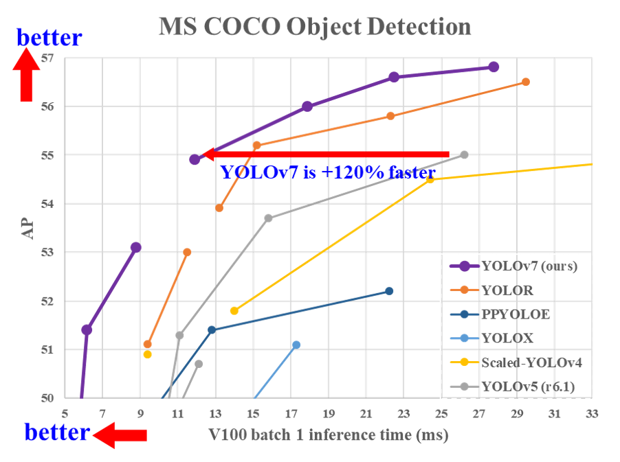
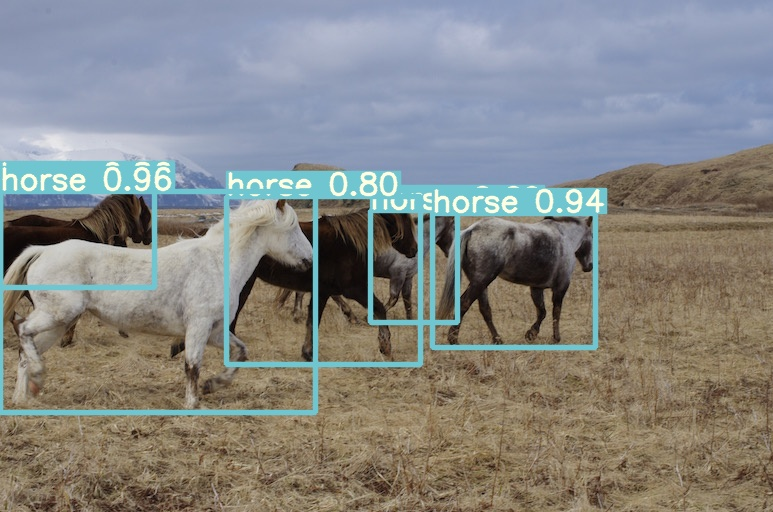
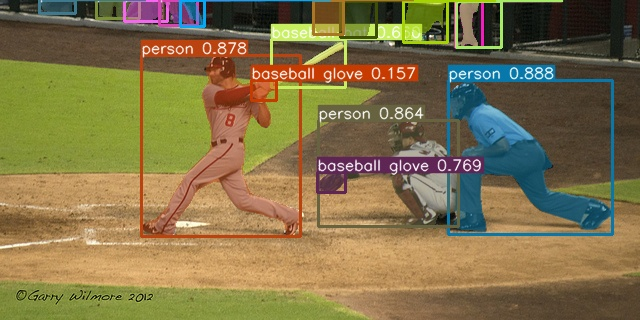
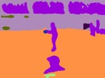
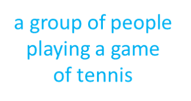

# Official YOLOv7

Implementation of paper - [YOLOv7: Trainable bag-of-freebies sets new state-of-the-art for real-time object detectors](https://arxiv.org/abs/2207.02696)

[](https://paperswithcode.com/sota/real-time-object-detection-on-coco?p=yolov7-trainable-bag-of-freebies-sets-new)
[](https://huggingface.co/spaces/akhaliq/yolov7)
<a href="https://colab.research.google.com/gist/AlexeyAB/b769f5795e65fdab80086f6cb7940dae/yolov7detection.ipynb"></a>
[](https://arxiv.org/abs/2207.02696)

<div align="center">
    <a href="./">
        
    </a>
</div>

## Web Demo

- Integrated into [Huggingface Spaces 🤗](https://huggingface.co/spaces/akhaliq/yolov7) using Gradio. Try out the Web Demo [](https://huggingface.co/spaces/akhaliq/yolov7)

## Performance 

MS COCO

| Model | Test Size | AP<sup>test</sup> | AP<sub>50</sub><sup>test</sup> | AP<sub>75</sub><sup>test</sup> | batch 1 fps | batch 32 average time |
| :-- | :-: | :-: | :-: | :-: | :-: | :-: |
| [**YOLOv7**](https://github.com/WongKinYiu/yolov7/releases/download/v0.1/yolov7.pt) | 640 | **51.4%** | **69.7%** | **55.9%** | 161 *fps* | 2.8 *ms* |
| [**YOLOv7-X**](https://github.com/WongKinYiu/yolov7/releases/download/v0.1/yolov7x.pt) | 640 | **53.1%** | **71.2%** | **57.8%** | 114 *fps* | 4.3 *ms* |
|  |  |  |  |  |  |  |
| [**YOLOv7-W6**](https://github.com/WongKinYiu/yolov7/releases/download/v0.1/yolov7-w6.pt) | 1280 | **54.9%** | **72.6%** | **60.1%** | 84 *fps* | 7.6 *ms* |
| [**YOLOv7-E6**](https://github.com/WongKinYiu/yolov7/releases/download/v0.1/yolov7-e6.pt) | 1280 | **56.0%** | **73.5%** | **61.2%** | 56 *fps* | 12.3 *ms* |
| [**YOLOv7-D6**](https://github.com/WongKinYiu/yolov7/releases/download/v0.1/yolov7-d6.pt) | 1280 | **56.6%** | **74.0%** | **61.8%** | 44 *fps* | 15.0 *ms* |
| [**YOLOv7-E6E**](https://github.com/WongKinYiu/yolov7/releases/download/v0.1/yolov7-e6e.pt) | 1280 | **56.8%** | **74.4%** | **62.1%** | 36 *fps* | 18.7 *ms* |

## Installation

Docker environment (recommended)
<details><summary> <b>Expand</b> </summary>

``` shell
# create the docker container, you can change the share memory size if you have more.
nvidia-docker run --name yolov7 -it -v your_coco_path/:/coco/ -v your_code_path/:/yolov7 --shm-size=64g nvcr.io/nvidia/pytorch:21.08-py3

# apt install required packages
apt update
apt install -y zip htop screen libgl1-mesa-glx

# pip install required packages
pip install seaborn thop

# go to code folder
cd /yolov7
```

</details>

## Testing

[`yolov7.pt`](https://github.com/WongKinYiu/yolov7/releases/download/v0.1/yolov7.pt) [`yolov7x.pt`](https://github.com/WongKinYiu/yolov7/releases/download/v0.1/yolov7x.pt) [`yolov7-w6.pt`](https://github.com/WongKinYiu/yolov7/releases/download/v0.1/yolov7-w6.pt) [`yolov7-e6.pt`](https://github.com/WongKinYiu/yolov7/releases/download/v0.1/yolov7-e6.pt) [`yolov7-d6.pt`](https://github.com/WongKinYiu/yolov7/releases/download/v0.1/yolov7-d6.pt) [`yolov7-e6e.pt`](https://github.com/WongKinYiu/yolov7/releases/download/v0.1/yolov7-e6e.pt)

``` shell
python test.py --data data/coco.yaml --img 640 --batch 32 --conf 0.001 --iou 0.65 --device 0 --weights yolov7.pt --name yolov7_640_val
```

You will get the results:

```
 Average Precision  (AP) @[ IoU=0.50:0.95 | area=   all | maxDets=100 ] = 0.51206
 Average Precision  (AP) @[ IoU=0.50      | area=   all | maxDets=100 ] = 0.69730
 Average Precision  (AP) @[ IoU=0.75      | area=   all | maxDets=100 ] = 0.55521
 Average Precision  (AP) @[ IoU=0.50:0.95 | area= small | maxDets=100 ] = 0.35247
 Average Precision  (AP) @[ IoU=0.50:0.95 | area=medium | maxDets=100 ] = 0.55937
 Average Precision  (AP) @[ IoU=0.50:0.95 | area= large | maxDets=100 ] = 0.66693
 Average Recall     (AR) @[ IoU=0.50:0.95 | area=   all | maxDets=  1 ] = 0.38453
 Average Recall     (AR) @[ IoU=0.50:0.95 | area=   all | maxDets= 10 ] = 0.63765
 Average Recall     (AR) @[ IoU=0.50:0.95 | area=   all | maxDets=100 ] = 0.68772
 Average Recall     (AR) @[ IoU=0.50:0.95 | area= small | maxDets=100 ] = 0.53766
 Average Recall     (AR) @[ IoU=0.50:0.95 | area=medium | maxDets=100 ] = 0.73549
 Average Recall     (AR) @[ IoU=0.50:0.95 | area= large | maxDets=100 ] = 0.83868
```

To measure accuracy, download [COCO-annotations for Pycocotools](http://images.cocodataset.org/annotations/annotations_trainval2017.zip) to the `./coco/annotations/instances_val2017.json`

## Training

Data preparation

``` shell
bash scripts/get_coco.sh
```

* Download MS COCO dataset images ([train](http://images.cocodataset.org/zips/train2017.zip), [val](http://images.cocodataset.org/zips/val2017.zip), [test](http://images.cocodataset.org/zips/test2017.zip)) and [labels](https://github.com/WongKinYiu/yolov7/releases/download/v0.1/coco2017labels-segments.zip). If you have previously used a different version of YOLO, we strongly recommend that you delete `train2017.cache` and `val2017.cache` files, and redownload [labels](https://github.com/WongKinYiu/yolov7/releases/download/v0.1/coco2017labels-segments.zip) 

Single GPU training

``` shell
# train p5 models
python train.py --workers 8 --device 0 --batch-size 32 --data data/coco.yaml --img 640 640 --cfg cfg/training/yolov7.yaml --weights '' --name yolov7 --hyp data/hyp.scratch.p5.yaml

# train p6 models
python train_aux.py --workers 8 --device 0 --batch-size 16 --data data/coco.yaml --img 1280 1280 --cfg cfg/training/yolov7-w6.yaml --weights '' --name yolov7-w6 --hyp data/hyp.scratch.p6.yaml
```

Multiple GPU training

``` shell
# train p5 models
python -m torch.distributed.launch --nproc_per_node 4 --master_port 9527 train.py --workers 8 --device 0,1,2,3 --sync-bn --batch-size 128 --data data/coco.yaml --img 640 640 --cfg cfg/training/yolov7.yaml --weights '' --name yolov7 --hyp data/hyp.scratch.p5.yaml

# train p6 models
python -m torch.distributed.launch --nproc_per_node 8 --master_port 9527 train_aux.py --workers 8 --device 0,1,2,3,4,5,6,7 --sync-bn --batch-size 128 --data data/coco.yaml --img 1280 1280 --cfg cfg/training/yolov7-w6.yaml --weights '' --name yolov7-w6 --hyp data/hyp.scratch.p6.yaml
```

## Transfer learning

[`yolov7_training.pt`](https://github.com/WongKinYiu/yolov7/releases/download/v0.1/yolov7_training.pt) [`yolov7x_training.pt`](https://github.com/WongKinYiu/yolov7/releases/download/v0.1/yolov7x_training.pt) [`yolov7-w6_training.pt`](https://github.com/WongKinYiu/yolov7/releases/download/v0.1/yolov7-w6_training.pt) [`yolov7-e6_training.pt`](https://github.com/WongKinYiu/yolov7/releases/download/v0.1/yolov7-e6_training.pt) [`yolov7-d6_training.pt`](https://github.com/WongKinYiu/yolov7/releases/download/v0.1/yolov7-d6_training.pt) [`yolov7-e6e_training.pt`](https://github.com/WongKinYiu/yolov7/releases/download/v0.1/yolov7-e6e_training.pt)

Single GPU finetuning for custom dataset

``` shell
# finetune p5 models
python train.py --workers 8 --device 0 --batch-size 32 --data data/custom.yaml --img 640 640 --cfg cfg/training/yolov7-custom.yaml --weights 'yolov7_training.pt' --name yolov7-custom --hyp data/hyp.scratch.custom.yaml

# finetune p6 models
python train_aux.py --workers 8 --device 0 --batch-size 16 --data data/custom.yaml --img 1280 1280 --cfg cfg/training/yolov7-w6-custom.yaml --weights 'yolov7-w6_training.pt' --name yolov7-w6-custom --hyp data/hyp.scratch.custom.yaml
```

## Re-parameterization

See [reparameterization.ipynb](tools/reparameterization.ipynb)

## Inference

On video:
``` shell
python detect.py --weights yolov7.pt --conf 0.25 --img-size 640 --source yourvideo.mp4
```

On image:
``` shell
python detect.py --weights yolov7.pt --conf 0.25 --img-size 640 --source inference/images/horses.jpg
```

<div align="center">
    <a href="./">
        
    </a>
</div>


## Export

**Pytorch to CoreML (and inference on MacOS/iOS)** <a href="https://colab.research.google.com/github/WongKinYiu/yolov7/blob/main/tools/YOLOv7CoreML.ipynb"></a>

**Pytorch to ONNX with NMS (and inference)** <a href="https://colab.research.google.com/github/WongKinYiu/yolov7/blob/main/tools/YOLOv7onnx.ipynb"></a>
```shell
python export.py --weights yolov7-tiny.pt --grid --end2end --simplify \
        --topk-all 100 --iou-thres 0.65 --conf-thres 0.35 --img-size 640 640 --max-wh 640
```

**Pytorch to TensorRT with NMS (and inference)** <a href="https://colab.research.google.com/github/WongKinYiu/yolov7/blob/main/tools/YOLOv7trt.ipynb"></a>

```shell
wget https://github.com/WongKinYiu/yolov7/releases/download/v0.1/yolov7-tiny.pt
python export.py --weights ./yolov7-tiny.pt --grid --end2end --simplify --topk-all 100 --iou-thres 0.65 --conf-thres 0.35 --img-size 640 640
git clone https://github.com/Linaom1214/tensorrt-python.git
python ./tensorrt-python/export.py -o yolov7-tiny.onnx -e yolov7-tiny-nms.trt -p fp16
```

**Pytorch to TensorRT another way** <a href="https://colab.research.google.com/gist/AlexeyAB/fcb47ae544cf284eb24d8ad8e880d45c/yolov7trtlinaom.ipynb"></a> <details><summary> <b>Expand</b> </summary>


```shell
wget https://github.com/WongKinYiu/yolov7/releases/download/v0.1/yolov7-tiny.pt
python export.py --weights yolov7-tiny.pt --grid --include-nms
git clone https://github.com/Linaom1214/tensorrt-python.git
python ./tensorrt-python/export.py -o yolov7-tiny.onnx -e yolov7-tiny-nms.trt -p fp16

# Or use trtexec to convert ONNX to TensorRT engine
/usr/src/tensorrt/bin/trtexec --onnx=yolov7-tiny.onnx --saveEngine=yolov7-tiny-nms.trt --fp16
```

</details>

Tested with: Python 3.7.13, Pytorch 1.12.0+cu113

## Pose estimation

[`code`](https://github.com/WongKinYiu/yolov7/tree/pose) [`yolov7-w6-pose.pt`](https://github.com/WongKinYiu/yolov7/releases/download/v0.1/yolov7-w6-pose.pt)

See [keypoint.ipynb](https://github.com/WongKinYiu/yolov7/blob/main/tools/keypoint.ipynb).

<div align="center">
    <a href="./">
        
    </a>
</div>


## Instance segmentation

[`code`](https://github.com/WongKinYiu/yolov7/tree/mask) [`yolov7-mask.pt`](https://github.com/WongKinYiu/yolov7/releases/download/v0.1/yolov7-mask.pt)

See [instance.ipynb](https://github.com/WongKinYiu/yolov7/blob/main/tools/instance.ipynb).

<div align="center">
    <a href="./">
        
    </a>
</div>


## Citation

```
@article{wang2022yolov7,
  title={{YOLOv7}: Trainable bag-of-freebies sets new state-of-the-art for real-time object detectors},
  author={Wang, Chien-Yao and Bochkovskiy, Alexey and Liao, Hong-Yuan Mark},
  journal={arXiv preprint arXiv:2207.02696},
  year={2022}
}
```


## Teaser

Yolov7-semantic & YOLOv7-panoptic & YOLOv7-caption

<div align="center">
    <a href="./">
        
    </a>
    <a href="./">
        
    </a>
    <a href="./">
        
    </a>
    <a href="./">
        
    </a>
</div>


## Acknowledgements

<details><summary> <b>Expand</b> </summary>

* [https://github.com/AlexeyAB/darknet](https://github.com/AlexeyAB/darknet)
* [https://github.com/WongKinYiu/yolor](https://github.com/WongKinYiu/yolor)
* [https://github.com/WongKinYiu/PyTorch_YOLOv4](https://github.com/WongKinYiu/PyTorch_YOLOv4)
* [https://github.com/WongKinYiu/ScaledYOLOv4](https://github.com/WongKinYiu/ScaledYOLOv4)
* [https://github.com/Megvii-BaseDetection/YOLOX](https://github.com/Megvii-BaseDetection/YOLOX)
* [https://github.com/ultralytics/yolov3](https://github.com/ultralytics/yolov3)
* [https://github.com/ultralytics/yolov5](https://github.com/ultralytics/yolov5)
* [https://github.com/DingXiaoH/RepVGG](https://github.com/DingXiaoH/RepVGG)
* [https://github.com/JUGGHM/OREPA_CVPR2022](https://github.com/JUGGHM/OREPA_CVPR2022)
* [https://github.com/TexasInstruments/edgeai-yolov5/tree/yolo-pose](https://github.com/TexasInstruments/edgeai-yolov5/tree/yolo-pose)

</details>
