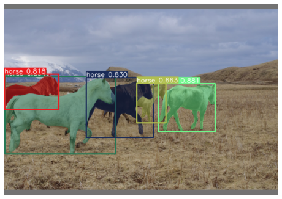

# Official YOLOv7

Implementation of paper - [YOLOv7: Trainable bag-of-freebies sets new state-of-the-art for real-time object detectors](https://arxiv.org/abs/2207.02696)

Instance segmentaion code is partially based on [BlendMask](https://arxiv.org/abs/2001.00309).

## Testing

[yolov7-mask.pt](https://github.com/WongKinYiu/yolov7/releases/download/v0.1/yolov7-mask.pt)

[[scripts]](./tools/instance.ipynb)

<div align="center">
    <a href="./">
        
    </a>
</div>

## Citation

```
@article{wang2022yolov7,
  title={{YOLOv7}: Trainable bag-of-freebies sets new state-of-the-art for real-time object detectors},
  author={Wang, Chien-Yao and Bochkovskiy, Alexey and Liao, Hong-Yuan Mark},
  journal={arXiv preprint arXiv:2207.02696},
  year={2022}
}
```

## Acknowledgements

<details><summary> <b>Expand</b> </summary>

* [https://github.com/AlexeyAB/darknet](https://github.com/AlexeyAB/darknet)
* [https://github.com/WongKinYiu/yolor](https://github.com/WongKinYiu/yolor)
* [https://github.com/WongKinYiu/PyTorch_YOLOv4](https://github.com/WongKinYiu/PyTorch_YOLOv4)
* [https://github.com/WongKinYiu/ScaledYOLOv4](https://github.com/WongKinYiu/ScaledYOLOv4)
* [https://github.com/Megvii-BaseDetection/YOLOX](https://github.com/Megvii-BaseDetection/YOLOX)
* [https://github.com/ultralytics/yolov3](https://github.com/ultralytics/yolov3)
* [https://github.com/ultralytics/yolov5](https://github.com/ultralytics/yolov5)
* [https://github.com/DingXiaoH/RepVGG](https://github.com/DingXiaoH/RepVGG)
* [https://github.com/JUGGHM/OREPA_CVPR2022](https://github.com/JUGGHM/OREPA_CVPR2022)
* [https://github.com/TexasInstruments/edgeai-yolov5/tree/yolo-pose](https://github.com/TexasInstruments/edgeai-yolov5/tree/yolo-pose)

</details>
