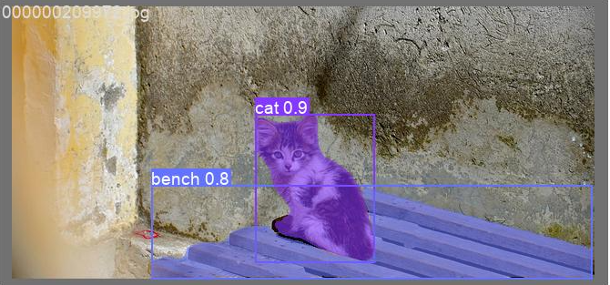

# yolov7

Implementation of "YOLOv7: Trainable bag-of-freebies sets new state-of-the-art for real-time object detectors"

This implimentation is based on [yolov5](https://github.com/ultralytics/yolov5).

All of installation, data preparation, and usage are as same as yolov5.

## Training

``` shell
python segment/train.py --data coco.yaml --batch 16 --weights '' --cfg yolov7-seg.yaml --epochs 300 --name yolov7-seg --img 640 --hyp hyp.scratch-high.yaml
```

## Results

[`yolov7-seg.pt`](https://github.com/WongKinYiu/yolov7/releases/download/v0.1/yolov7-seg.pt)

```
Object detection:
 Average Precision  (AP) @[ IoU=0.50:0.95 | area=   all | maxDets=100 ] = 0.49629
 Average Precision  (AP) @[ IoU=0.50      | area=   all | maxDets=100 ] = 0.67746
 Average Precision  (AP) @[ IoU=0.75      | area=   all | maxDets=100 ] = 0.53842
 Average Precision  (AP) @[ IoU=0.50:0.95 | area= small | maxDets=100 ] = 0.32679
 Average Precision  (AP) @[ IoU=0.50:0.95 | area=medium | maxDets=100 ] = 0.55475
 Average Precision  (AP) @[ IoU=0.50:0.95 | area= large | maxDets=100 ] = 0.63948
 Average Recall     (AR) @[ IoU=0.50:0.95 | area=   all | maxDets=  1 ] = 0.37569
 Average Recall     (AR) @[ IoU=0.50:0.95 | area=   all | maxDets= 10 ] = 0.61747
 Average Recall     (AR) @[ IoU=0.50:0.95 | area=   all | maxDets=100 ] = 0.66796
 Average Recall     (AR) @[ IoU=0.50:0.95 | area= small | maxDets=100 ] = 0.49381
 Average Recall     (AR) @[ IoU=0.50:0.95 | area=medium | maxDets=100 ] = 0.72859
 Average Recall     (AR) @[ IoU=0.50:0.95 | area= large | maxDets=100 ] = 0.81632

Instance segmentation:
 Average Precision  (AP) @[ IoU=0.50:0.95 | area=   all | maxDets=100 ] = 0.40531
 Average Precision  (AP) @[ IoU=0.50      | area=   all | maxDets=100 ] = 0.64003
 Average Precision  (AP) @[ IoU=0.75      | area=   all | maxDets=100 ] = 0.42996
 Average Precision  (AP) @[ IoU=0.50:0.95 | area= small | maxDets=100 ] = 0.22329
 Average Precision  (AP) @[ IoU=0.50:0.95 | area=medium | maxDets=100 ] = 0.46102
 Average Precision  (AP) @[ IoU=0.50:0.95 | area= large | maxDets=100 ] = 0.56453
 Average Recall     (AR) @[ IoU=0.50:0.95 | area=   all | maxDets=  1 ] = 0.32220
 Average Recall     (AR) @[ IoU=0.50:0.95 | area=   all | maxDets= 10 ] = 0.51069
 Average Recall     (AR) @[ IoU=0.50:0.95 | area=   all | maxDets=100 ] = 0.54511
 Average Recall     (AR) @[ IoU=0.50:0.95 | area= small | maxDets=100 ] = 0.34929
 Average Recall     (AR) @[ IoU=0.50:0.95 | area=medium | maxDets=100 ] = 0.61070
 Average Recall     (AR) @[ IoU=0.50:0.95 | area= large | maxDets=100 ] = 0.72177
```

## Examples

<div align="center">
    <a href="./">
        
    </a>
</div>
